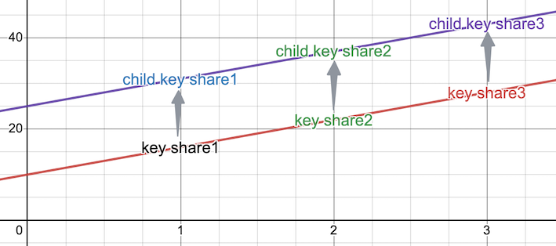

# Threshold Signature Scheme

## 1、Background

Currently, there are two main types of protocols for ECDSA threshold signatures. The first type is the 2/2 signature
proposed in the Lindell 17’ paper[1], and the second is the t/n signature represented by GG18[2] and GG20[3]. The t/n
threshold signature protocol is relatively complex, requiring multiple rounds of communication between the parties
during the generation and signing phases. It is not fast enough to meet the needs of high-traffic web3 use cases. In
contrast, the 2/2 signature scheme proposed in the Lindell 17’ paper has a higher signing efficiency. However, if a key
share is accidentally lost, the user’s asset will be unrecoverable. In view of this, we propose a 2/n signature scheme
as an improvement on the Lindell 17’ protocol to balance signing efficiency and meet the business requirement of web3
use cases.

## 2、Overview of the Solution

We propose an ECDSA 2/n signature scheme based on Feldman's Verifiable Secret Sharing scheme (Feldman's VSS) and the
Lindell 17’ protocol. When generating private key shares, we use the Feldman's VSS to generate individual private key
share. During the signing phase, we use the Lindell 17’ protocol for two-party signatures to ensure the efficiency of
the signing process. In the event of a lost or leaked key share, the user's assets will remain secure. Additionally, we
support bip32 non-hardened key derivation, which only requires one key generation and can support multiple
cryptocurrencies. If a key share is lost or leaked by one party, or if a new participant joins, we support resetting the
key share to a new set of private key shares.

## 3、Supported Functionalities

This library implements the following functions:

1. Key generation: Generates {2,n} key shares using Feldman's VSS. In the case of ECDSA signing, additional key
   negotiation between the two parties is required to meet the Lindell 17’ two-party signature rule.
2. Key share refresh: If a key share is lost or leaked by one party, or if a new participant joins, all parties
   regenerate new random shares of the existing shared key and void the old shares.
3. Bip32 key derivation: None of the parties know the complete private key. Only non-hardened key derivation is
   supported. Chaincode is jointly generated by multiple parties in the keygen phase.
4. 2-party ECDSA signing: Uses the Lindell 17’ protocol to perform 2-party signatures according to the key generation
   rule. Neither party alone can generate a complete signature.
5. 2-party ed25519 signing: A variant of EdDSA and Schnorr, where both parties jointly compute the complete signature.

## 4、Cryptographic Tools

### BIP32

BIP32 (Bitcoin Improvement Proposal 32) is a standard for creating hierarchical deterministic (HD) wallets in Bitcoin
and other cryptocurrencies. It allows users to generate an infinite number of public and private key pairs from a single
seed, making it easier to manage and secure cryptocurrency funds.

1. Master Key Generation: A random 256-bit seed is generated, which serves as the master private key. The corresponding
   master public key is derived from the master private key using elliptic curve multiplication.
2. Key Derivation: Each child key is derived from its parent key with a hardened or non-hardened derivation method.
   Hardened derivation is used when a parent key wants to create a child key that cannot be used to derive other child
   keys, while non-hardened derivation allows child keys to be derived from other child keys.

### Commitment Schemes

Commitment schemes are cryptographic protocols that allow a party to commit to a value without revealing it, and later
reveal the value while proving that it has not been changed. A commitment scheme involves two phases: commitment and
opening, shown below:

$$Commitment: C = commit(m, r)$$ where:

- m is the value to be committed
- r is a random string
- C is the commitment string

$$Opening: (m', r') = open(C)$$ where:

- m' is the revealed value
- r' is the revealed random string

### ECDSA Signing

ECDSA signing is the process of creating a digital signature for a message using the signer's private key. The digital
signature is used to authenticate the sender of the message and ensure the integrity of its content. ECDSA signature
scheme allows the public key to be recovered from the signed message together with the signature.

<b>Key Generation</b>

1. Choose an elliptic curve with a generator point G, and order n.
2. Generate a random private key a, such that 1 < a < n.
3. Compute the public key A = aG.

<b>Sign</b>

1. Hashing: The message m is hashed using a cryptographic hash function to produce a fixed-length message digest H(m).
2. Random Number Generation: A random number k is generated between 1 and the order n of the curve.
3. Point Computation: The signer computes the point R = kG on the elliptic curve.
4. Scalar Computation: The signer computes the scalar s = (k^-1 * (H(m) + a * r)) mod n, where r is the x-coordinate of
   R.
5. Signature Generation: The signer generates the digital signature (r, s).

$$ ECDSA-sign(msg, privKey) --> (r, s) $$

### ED25519 Signing

Ed25519[4] is a public-key digital signature algorithm based on elliptic curve cryptography. Ed25519 uses a twisted
Edwards curve and a modified version of the Schnorr signature scheme. The algorithm has several advantages over other
digital signature algorithms, including resistance to side-channel attacks, immunity to timing attacks, and a compact
signature size of only 64 bytes.

<b>Key Generation</b>

1. Generate a random 256-bit private key k.
2. Compute H(k), where H is the SHA-512 hash function. Store the lower 32 bytes of the digest in a buffer.
3. Prune the buffer: Clear the lowest three bits and the highest bit. Set the second highest bit. The resulting buffer
   is interpreted as little-endian integer b.
4. Compute the public key A = bG.

<b>Sign</b>

1. Hashing: Compute H(k) again. Store the higher 32 bytes of the digest in prefix.
2. Random Number Generation: The signer computes the scalar r = H(prefix || H(m)), where m is the message to be signed.
3. Point Computation: The signer computes the point R = rG on the ED25519 curve.
4. Scalar Computation: The signer computes the scalar s = r + H(R || A || m) * b mod n.
5. Signature Generation: The signer generates the digital signature (R, s).

$$ Ed25519-sign(msg, privKey) --> (R, s) $$

### Feldman's VSS

Feldman's Verifiable Secret Sharing (VSS) is a cryptographic protocol that enables a dealer to distribute a secret among
a group of participants, in such a way that it can be reconstructed only if a minimum number of parties cooperate. It
involves four steps as follows:

1. Setup: Choose a large prime p and a generator g of a subgroup of order q, where q is a prime that divides p-1. Let x
   be the secret value and compute y = g^x mod p.
2. Share distribution: The dealer randomly selects a polynomial f(x) of degree t-1 such that f(0) = x, and sends the
   shares (i, s_i) to the participants, where s_i = f(i) mod p for i = 1 to n. The dealer also computes the
   corresponding polynomial g(x) = f(x) + r(x) mod p, where r(x) is a random polynomial of degree t-1, and sends the
   commitments (i, C_i) to the participants, where C_i = g^i mod p for i = 1 to n.
3. Verification: Each participant verifies the validity of their share s_i by checking that y^s_i * g^(-i) mod p = 1,
   and the validity of the commitments by checking that C_i = g^i mod p for i = 1 to n.
4. Reconstruction: Any subset of t or more qualified participants can reconstruct the secret x by using Lagrange
   interpolation on their shares.

### Paillier Encryption

Paillier encryption is a public-key encryption scheme that enables secure computation on encrypted data without
decrypting. Paillier encryption provides additive homomorphic encryption, meaning that the sum of two encrypted messages
can be computed as the product of their ciphertexts.

$$ c1 * c2 = g^{(m1 + m2)} * r^{(N^2)} mod N^2 $$

1. Key Generation: Choose two large prime numbers p and q, and compute N = pq. Choose a random g that is relatively
   prime to N, and compute λ = lcm(p-1, q-1), where lcm is the least common multiple. The public key is (N, g), and the
   private key is λ.
2. Encryption: To encrypt a plaintext message m, choose a random value r that is less than N, and compute the ciphertext
   c as follows:
   $$c = g^m * r^N mod N^2$$
3. Decryption: To decrypt the ciphertext c, compute the plaintext message m as follows:
   $$m = L(c^λ mod N^2) / L(g^λ mod N^2) mod N$$ where $$L(x) = (x-1) / N$$

### Schnorr Proof

Schnorr non-interactive zero-knowledge (NIZK) proof[5] is a non-interactive variant of the three-pass Schnorr
identification scheme. The Schnorr NIZK proof allows one to prove the knowledge of a discrete logarithm without leaking
any information about its value, with steps as follows:

1. Alice publishes her public key A = aG, where a is the private key and G is the generator
2. Alice chooses a random number v, computes V = vG, and sends V to Bob
3. Alice computes the challenge c = H(G || V || A)
4. Alice computes r = v – a * c mod n and sends it to Bob
5. Bob verifies V = rG + cA

## 5、Threshold Scheme Overview

After describing all the cryptographic primitives and tools used in our solution, we will now describe the details of
the protocol.

### ECDSA

Key shares are generated according to Feldman's VSS scheme, and two-party signatures are performed according to the
Lindell 17’ protocol. In the original Lindell 17’ protocol definition, the private key x = x1*x2 is not easily
extendable to 2/n signature scheme. Therefore, we make a modification by changing the definition of private key to x =
x1 + x2. The details of the modification are as follows:

```text
             original                                 modify           
privateKey  x = x1*x2                                x = x1 + x2
publicKey   X = x1*x2*G = x1*X2 = x2*X1              X = X1 + X2 = x1*G + x2*G
sign
            k = k1*k2                                k = k1*k2
            s = (h + r*x1*x2)/(k1*k2) mod q          s = (h + r*(x1+x2))/(k1*k2) mod q
    
```

#### Distributed Key Generation

Each party generates an ECDSA key share to be used for signing, as follows:

1. n participants each generate their own key share using the Feldman's VSS protocol based on the 2/n signature scheme,
   and output (ld, share_i, publicKey, chaincode).
2. The signing rule is determined to specify which two parties will jointly participate in signing. When two parties
   sign, one acts as Alice and the other as Bob. Alice and Bob each perform a Lagrange interpolation calculation on
   their own share_i to obtain x1 and x2, respectively. The private key is x = x1 + x2.
3. Alice randomly generates a Paillier public-private key pair and uses the Paillier public key to encrypt x1. Alice
   also proves to Bob that she knows x1 with zero knowledge. E_x1 represents the ciphertext, and Alice sends E_x1 and
   the Paillier public key to Bob.
4. Alice outputs her Paillier private key and (ld, share_i, publicKey, chaincode).
5. Bob outputs the Paillier public key and (ld, share_i, publicKey, chaincode, E_x1).

#### Signing

After obtaining the message to be signed, Alice and Bob jointly generate the signature using the Lindell 17’ protocol,
as follows:

1. Alice and Bob generate random numbers k1 and k2, and both learn R = k1\*k2\*G. Commitments and zero-knowledge proofs
   are used to ensure the security of the learning process.
2. Given R = (rx, ry), Alice and Bob can each compute r = rx mod q.
3. Bob computes the partial signature of m under the Paillier homomorphic encryption scheme: (m + r(x1 + x2))/k2 mod q,
   and sends the partial signature to Alice.
4. Alice decrypts the partial signature using her Paillier private key and computes the full signature: (m + r*(x1 +
   x2))/(k1*k2) mod q. Then, she verifies the signature using the public key. If the signature is valid, she outputs the
   signature; otherwise, the signature fails.

### Ed25519

Generate key shares for each party using Feldman's VSS protocol. After obtaining the message to be signed m, any two
parties can jointly generate a signature as follows:

1. Alice and Bob respectively compute x1 and x2 by performing a Lagrange interpolation on their own share_i. The
   complete private key x=x1+x2.
2. Alice and Bob respectively generate random numbers r1 and r2, and respectively compute R1=r1*G, R2=r2*G. Then both
   Alice and Bob learn R=R1+R2. Commitments and zero-knowledge proofs are used to ensure the security of the learning
   process.
3. Each party can compute h=sha512(R, pub, m), where pub is the public key corresponding to the complete private key x.
4. Alice and Bob each compute their own signature si=ri+h*xi, and send the signature result to the other party.
5. Compute the complete signature s=s1+s2, and verify the signature using the public key.

### Reshare

If a party's share is lost or leaked, or if new participants join, a new set of key shares can be generated. The refresh
process only requires the participation of the two previously generated shares, and the process is similar to the
private key generation process, with the chaincode remaining unchanged.

### Key Derivation

The derivation rule is similar to BIP32, where no party knows the complete private key and can only perform non-hardened
derivation. The chaincode is generated jointly by multiple parties during the key generation phase and is not changed
during the refresh phase.

After Key Generation, each party has its own share, and all shares are related and on the same curve. Each share can be
derived along the same path to obtain a child key share, which is also on the same curve, resulting in a new set of key
shares.



## 6、Summary

Based on the Lindell 17’ protocol, we propose improvements for secure multi-party computation of ECDSA, extending 2/2
signatures to 2/n signatures. Private key shares are generated using Feldman’s VSS scheme, and the Lindell 17’ protocol
is used for two-party signature generation, balancing signature efficiency and meeting the practical requirements of
business scenarios. This library also supports bip32 key derivation and private key refreshing for key shares, making it
easy for developers to learn and use.

## 7、Reference

[1] Lindell, Y. (2017). Fast Secure Two-Party ECDSA Signing. https://eprint.iacr.org/2017/552

[2] Gennaro, R. (2019). Fast Multiparty Threshold ECDSA with Fast Trustless Setup. https://eprint.iacr.org/2019/114

[3] Gennaro, R. (2020). One Round Threshold ECDSA with Identifiable Abort. https://eprint.iacr.org/2020/540

[4] Josefsson, S. (2017, January). RFC 8032: Edwards-Curve Digital Signature Algorithm (EdDSA)
. https://www.rfc-editor.org/rfc/rfc8032

[5] Hao, F. (2017, September). RFC 8235: Schnorr Non-interactive Zero-Knowledge
Proof. https://www.rfc-editor.org/rfc/rfc8235

[6] https://github.com/unboundsecurity/blockchain-crypto-mpc/blob/master/docs/Unbound_Cryptocurrency_Wallet_Library_White_Paper.md